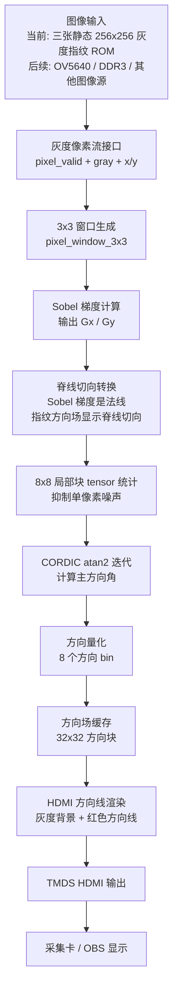

# 基于 FPGA 的指纹图像方向场计算与可视化系统

## 项目概述

本项目面向指纹图像结构分析，在 FPGA 上实现从灰度指纹图像输入、Sobel 梯度计算、CORDIC 方向角计算、局部区域统计到方向场可视化输出的完整处理链路。当前工程重点验证“指纹图像进入板子后，经过硬件流水线处理，最终在 HDMI 画面中叠加显示方向场”的核心流程。

当前阶段采用多张 256×256 静态灰度指纹图像作为输入，通过板载 `SW[1:0]` 切换不同图像。系统将指纹图像放大显示到 HDMI 画面中，并把方向场以红色线段叠加在灰度指纹背景上，最后通过 HDMI 接采集卡，在电脑 OBS 中观察结果。

项目使用环境：

- FPGA 器件：Xilinx Artix-7 `XC7A75T-2FGG484`
- 开发软件：Vivado 2025.2
- 当前输入：片上静态 ROM 指纹图像
- 当前输出：HDMI-A 输出到采集卡，在 OBS 中查看
- 当前顶层：`fingerprint_ref_hdmi_static_top`

## 设计目标

本项目的目标不是只做一张仿真图，而是逐步形成可在实际 FPGA 板卡上运行的指纹方向场处理系统。当前已经完成的是静态输入验证阶段，后续可在保持 Sobel、CORDIC 和方向统计主处理链路不变的情况下，把输入端替换为摄像头、DDR3 或其他真实图像输入。

核心目标包括：

1. 将输入图像转换为同步灰度像素流；
2. 使用 3×3 窗口生成模块为 Sobel 提供邻域像素；
3. 通过 Sobel 算子计算 `Gx` 和 `Gy`；
4. 将 Sobel 梯度法线转换为指纹脊线切向方向；
5. 使用局部块 tensor 统计增强方向稳定性；
6. 使用 CORDIC 迭代计算方向角并量化为方向编号；
7. 缓存方向场结果，并叠加到灰度指纹图像上；
8. 通过 HDMI 输出最终可视化结果。

## 系统原理图



## 当前处理流程

### 1. 多图像静态输入

当前输入端使用 `image_static_mem_source`，将三张 256×256 灰度指纹图像写入一个连续 ROM 中。这样做有两个原因：

- 便于在没有摄像头和 DDR3 的情况下先验证算法链路；
- 避免为每张图像复制一套 Sobel、CORDIC 和方向统计逻辑。

板上图像选择关系如下：

| `SW[1:0]` | 当前输入图像 |
| --- | --- |
| `2'b00` | 第 1 张指纹图 |
| `2'b01` | 第 2 张指纹图 |
| `2'b10` | 第 3 张指纹图 |
| `2'b11` | 保留，默认回到第 1 张 |

对应约束来自开发手册：

- `sw[0]`：SW1，管脚 `N14`
- `sw[1]`：SW2，管脚 `P16`

### 2. Sobel 梯度计算

像素流进入 `pixel_window_3x3` 后形成 3×3 邻域，再送入 `sobel_core` 计算梯度：

- `Gx`：水平方向灰度变化；
- `Gy`：垂直方向灰度变化。

Sobel 输出本质上表示灰度变化最快的方向，也就是纹线边缘的法线方向。指纹方向场需要显示的是纹线走向，因此不能直接把 Sobel 梯度角当成最终显示角。

### 3. 指纹脊线切向方向

项目中已经固定一个重要约定：

> 显示的方向场必须表示指纹脊线切向方向，不显示 Sobel 梯度法线。

当前实现中，`block_tensor_stat` 在局部统计前将 Sobel 梯度旋转到脊线切向方向：

```text
ridge_gx = -Gy
ridge_gy =  Gx
```

随后再进行 tensor 累加和 CORDIC 角度计算。这样比单纯在最后显示阶段临时旋转更符合方向场计算逻辑，也更接近指纹纹线的真实走向。

### 4. 局部块 tensor 统计

当前方向统计单位是 `8x8` 源图像块。对于 256×256 图像，会得到 `32x32` 个方向块。相比早期较稀疏的方向线，当前密度更高，更适合观察真实指纹纹理的局部变化。

统计阶段还加入了梯度强度筛选，低梯度像素不会参与方向投票，减少背景、噪声或模糊区域对主方向的干扰。

### 5. CORDIC 方向计算与量化

`cordic_tensor_direction` 对局部 tensor 向量进行 CORDIC 风格的 `atan2` 迭代计算。由于 tensor 编码的是二倍角信息，最终方向角需要做二分处理，再量化到 8 个方向：

| 编号 | 方向角 |
| --- | --- |
| 0 | 0° |
| 1 | 22.5° |
| 2 | 45° |
| 3 | 67.5° |
| 4 | 90° |
| 5 | 112.5° |
| 6 | 135° |
| 7 | 157.5° |

为了让 HDMI 显示结果更贴合指纹纹理，显示端保留已经验证正确的水平和垂直方向，并对斜向方向做镜像修正。这样存储的算法方向和最终显示方向都能保持一致的工程语义：最终画面中的线段跟随指纹脊线，而不是垂直于脊线。

### 6. HDMI 可视化输出

当前 HDMI 显示链路使用参考 HDMI 模块，输出 `1024x768` 时序。显示区域中，256×256 指纹图像被放大为 512×512，方向场以红色线段叠加在灰度背景上：

- 灰度背景：当前选中的指纹图像；
- 方向线段：红色 `RGB565 = 16'hF800`；
- 方向块：32×32；
- 每个方向块在显示区域中占 16×16 像素。

红色线段相比白色线段在灰度指纹背景上更醒目，尤其适合在 OBS 中观察和截图。

## 工程结构

主要文件保留在 Vivado 工程目录中，便于 GUI 和脚本使用同一套源文件。

```text
E:/FPGAvivado/FPGAprojx/
  README.md
  scripts/
    run_xsim_static_source.tcl
    run_xsim_static_top.tcl
    run_xsim_hdmi_renderer.tcl
    run_xsim_ref_hdmi_static_elab.tcl
    run_synth_ref_hdmi_static.tcl
    prepare_fingerprint_set.py
  fingerprint_direction_fpga/
    fingerprint_direction_fpga.xpr
    fingerprint_direction_fpga.srcs/
      sources_1/new/
        image/
          image_static_mem_source.v
          pixel_window_3x3.v
          fingerprint_0_256.mem
          fingerprint_1_256.mem
          fingerprint_2_256.mem
        sobel/
          sobel_core.v
        direction/
          block_tensor_stat.v
        cordic/
          cordic_tensor_direction.v
        display/
          direction_field_buffer.v
          hdmi_direction_field_renderer.v
          ref_hdmi_top.v
          ref_video_driver.v
        top/
          fpga_orientation_pipeline.v
          fpga_orientation_static_top.v
          fingerprint_ref_hdmi_static_top.v
      sim_1/new/
        tb_static_image_source.v
        tb_fpga_orientation_static_top.v
        tb_hdmi_direction_field_renderer.v
      constrs_1/new/
        phase1_base.xdc
```

## 已完成内容

当前工程已经完成：

- 256×256 灰度指纹静态 ROM 输入；
- 三张指纹图像通过 `SW[1:0]` 切换；
- 3×3 窗口生成；
- Sobel `Gx/Gy` 梯度计算；
- 梯度法线到指纹脊线切向的方向转换；
- 8×8 局部块 tensor 方向统计；
- CORDIC 方向角计算；
- 8 方向量化；
- 32×32 方向场缓存；
- 灰度指纹背景叠加红色方向线；
- HDMI 输出到采集卡/OBS 的静态演示链路；
- XSim 仿真、顶层 elaboration 和综合脚本验证。

## 验证方式

### 静态图像源验证

```powershell
vivado -mode batch -source scripts/run_xsim_static_source.tcl
```

期望日志包含：

```text
STATIC_SOURCE_TEST_PASS
```

### 算法静态顶层验证

```powershell
vivado -mode batch -source scripts/run_xsim_static_top.tcl
```

期望日志包含：

```text
STATIC_TOP_TEST_PASS
```

### HDMI 方向线渲染验证

```powershell
vivado -mode batch -source scripts/run_xsim_hdmi_renderer.tcl
```

期望日志包含：

```text
HDMI_RENDER_TEST_PASS
```

### HDMI 静态顶层 elaboration

```powershell
vivado -mode batch -source scripts/run_xsim_ref_hdmi_static_elab.tcl
```

期望日志包含：

```text
REF_HDMI_STATIC_ELAB_PASS
```

### 综合检查

```powershell
vivado -mode batch -source scripts/run_synth_ref_hdmi_static.tcl
```

最近一次验证结果为：

```text
synth_design completed successfully
0 Errors
0 Critical Warnings
```

## Vivado 使用步骤

如果要在板子上看当前静态指纹方向场演示，推荐在 Vivado GUI 中重新生成 bitstream，避免工程状态 out-of-date。

1. 打开工程：

   ```text
   E:/FPGAvivado/FPGAprojx/fingerprint_direction_fpga/fingerprint_direction_fpga.xpr
   ```

2. 确认顶层模块：

   ```text
   fingerprint_ref_hdmi_static_top
   ```

3. 依次运行：

   ```text
   Run Synthesis
   Run Implementation
   Generate Bitstream
   ```

4. 连接硬件：

   ```text
   FPGA HDMI-A -> HDMI 采集卡 -> 电脑 OBS
   ```

5. 在 Hardware Manager 中烧录生成的 bitstream。

6. 在 OBS 中添加视频采集设备，若自动识别异常，可手动设置为当前参考 HDMI 时序对应的分辨率。

7. 使用 `SW1/SW2` 切换三张静态指纹图像。

## 如何替换静态指纹图像

当前工程通过 `scripts/prepare_fingerprint_set.py` 将 `fingers_pics/` 中的输入图片转换为 256×256 灰度 `.mem` 文件和 PNG 预览图。默认输入文件名为：

```text
fingers_pics/finger_1.png
fingers_pics/finger_2.png
fingers_pics/finger_3_reality.png
```

运行脚本：

```powershell
python scripts/prepare_fingerprint_set.py
```

生成结果会写入：

```text
fingerprint_direction_fpga/fingerprint_direction_fpga.srcs/sources_1/new/image/fingerprint_0_256.mem
fingerprint_direction_fpga/fingerprint_direction_fpga.srcs/sources_1/new/image/fingerprint_1_256.mem
fingerprint_direction_fpga/fingerprint_direction_fpga.srcs/sources_1/new/image/fingerprint_2_256.mem
```

替换 `.mem` 后需要重新综合、实现并生成 bitstream。

## 项目中已经修正的关键问题

### 1. 方向场不能显示 Sobel 梯度法线

早期显示结果中，方向线容易与指纹纹线垂直。原因是 Sobel 梯度表示的是灰度变化法线，而指纹方向场需要的是脊线切向。当前算法已经在 tensor 统计前完成法线到切向的转换，并在显示端保留斜向修正。

### 2. 方向线密度需要贴近真实指纹纹理

真实指纹图像中局部方向变化比较密集。当前统计块从较稀疏的显示方式调整到 `8x8` 源图像块，对应 `32x32` 方向场，显示线段更密集，更适合观察纹线结构。

### 3. 高密度显示需要避免视觉干扰

白色方向线在部分灰度背景上不够清楚，当前改为红色方向线，便于 OBS 截图和肉眼判断方向场是否贴合纹理。

### 4. 多图像输入不应复制算法链路

当前只在输入端通过 `SW[1:0]` 选择三张 ROM 图像，后面的 Sobel、CORDIC、方向统计和 HDMI 渲染链路只有一套，避免重复逻辑。

### 5. ROM 结构需要考虑综合效率

早期多 ROM 和跨层优化会让 Vivado synthesis 卡在优化阶段。当前将三张图片组织为一个连续 ROM，并对图像源模块保持层级，使综合恢复到可接受时间。

## 总结

本项目完成了 FPGA 指纹方向场计算系统的静态图像验证版本。系统能够从片上 ROM 读取多张灰度指纹图像，经 Sobel、CORDIC 和局部 tensor 统计得到指纹脊线方向场，并通过 HDMI 输出灰度指纹背景与红色方向线叠加结果。
